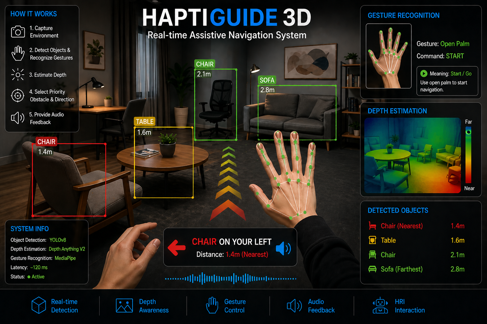

  

# HaptiGuide3D
HaptiGuide3D is a real-time assistive navigation system that combines computer vision and gesture-based interaction to support visually impaired users in indoor environments.

---



---
## 🚀 Features

- Real-time object detection using YOLOv8  
- Depth estimation using Depth Anything V2  
- Hand gesture recognition using MediaPipe  
- Directional audio feedback for navigation  
- Interactive Human–Robot Interaction (HRI) loop  

---

## 🧠 How It Works

1. Capture environment using RGB camera  
2. Detect objects and recognize hand gestures  
3. Estimate relative depth of objects  
4. Select priority obstacle and direction  
5. Provide audio feedback to guide the user  

---

## 🏗️ Project Structure

```
HaptiGuide3D/
│
├── src/                  # Core modules
├── sounds/               # Audio feedback files
├── outputs/              # Output results
├── main.py               # Main entry point
├── requirements.txt      # Dependencies
├── RUN__APP.bat          # Run standard version
├── RUNGOGGLES_APP.bat    # Run goggles interface
└── yolov8n.pt            # YOLO model
```

## ⚙️ Installation

### 1. Clone the repository

```bash
git clone https://github.com/hmd-vision/HaptiGuid3D.git
cd HaptiGuide3D
```

### 2. Install dependencies

```bash
pip install -r requirements.txt
```


## ▶️ Run the Application

### Option 1 (Windows - Recommended)
```bash
RUN__APP.bat
```

### Option 2 (Goggles UI)
```bash
RUNGOGGLES_APP.bat
```

### Option 3 (Manual)
```bash
python main.py
```

---

## 📊 Performance

- Object Detection Accuracy: **92.1%**
- Depth Estimation Error: **0.083**
- Gesture Recognition Accuracy: **96.4%**
- Latency: **~120 ms**

---

## ⚠️ Limitations

- Sensitive to low-light conditions  
- Gesture recognition affected by occlusion  
- Currently limited to indoor environments  

---

## 🔮 Future Work

- Add haptic feedback  
- Improve outdoor performance  
- Personalize feedback based on user behavior  
- Predict user intention (proactive assistance)  
---

## 📚 Technologies Used

- Python  
- OpenCV  
- YOLOv8  
- MediaPipe  
- Depth Anything V2  
- Pygame (audio feedback)  

## 🎯 Demo

<p align="center">
  
  <br>
  <em>Real-time object detection, depth estimation, and gesture-based navigation</em>
</p>